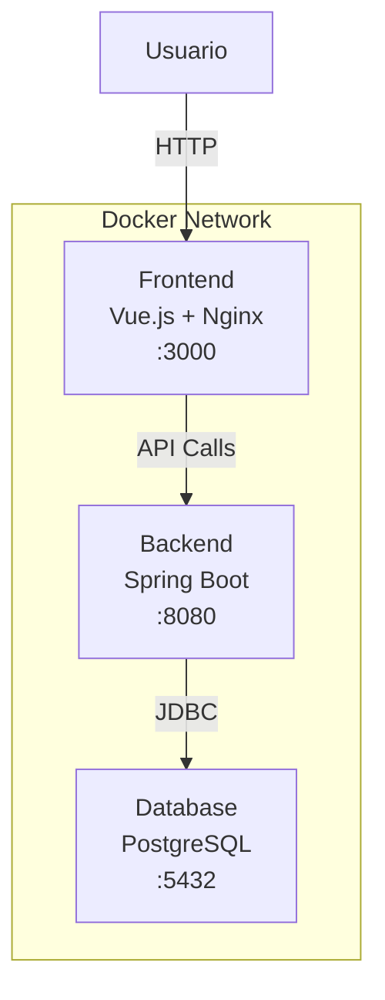

# 🏋️‍♂️ Sistema de Gestión de Gimnasios

Este proyecto es una aplicación web completa para la gestión integral de gimnasios. Permite administrar usuarios, entrenadores, clases, rutinas, accesos, medallas y mucho más, facilitando tanto la gestión interna como la experiencia de los clientes. Incluye un backend desarrollado en Spring Boot, un frontend moderno en Vue.js y una base de datos PostgreSQL, todo orquestado con Docker para facilitar la instalación y despliegue.

A continuación, encontrarás la guía de instalación rápida para poner en marcha el sistema en tu entorno local usando Docker.

# 🐳 Instalación con Docker - Sistema de Gestión de Gimnasios

Este documento te guiará para instalar y ejecutar el proyecto completo usando Docker de forma rápida y sencilla.

## 📋 Prerrequisitos

Antes de comenzar, asegúrate de tener instalado:

- **Docker** (versión 20.10 o superior)
- **Docker Compose** (versión 2.0 o superior)

### Instalación de Docker

#### Windows
1. Descarga Docker Desktop desde [docker.com](https://www.docker.com/products/docker-desktop/)
2. Ejecuta el instalador y sigue las instrucciones
3. Reinicia tu ordenador si es necesario

#### macOS
1. Descarga Docker Desktop desde [docker.com](https://www.docker.com/products/docker-desktop/)
2. Arrastra Docker a la carpeta Applications
3. Ejecuta Docker desde Applications

#### Linux (Ubuntu/Debian)
```bash
# Actualizar paquetes
sudo apt update

# Instalar Docker
sudo apt install docker.io docker-compose

# Agregar usuario al grupo docker
sudo usermod -aG docker $USER

# Cerrar sesión y volver a entrar para aplicar cambios
```

## 🚀 Instalación Rápida

### Paso 1: Clonar el repositorio
```bash
git clone https://gitlab.com/amb00093/tfg-gestion-gimnasios.git
cd tfg-gestion-gimnasios
```

### Paso 2: Ejecutar con Docker Compose
```bash
docker-compose up
```

**¡Eso es todo!** 

El comando anterior:
- Descargará todas las imágenes necesarias
- Construirá los contenedores del backend y frontend
- Configurará PostgreSQL con datos iniciales
- Iniciará todos los servicios

## 🌐 Acceder a la aplicación

Una vez que todos los contenedores estén ejecutándose:

- **Frontend (Aplicación Web)**: http://localhost:3000
- **Backend (API)**: http://localhost:8080
- **Base de datos PostgreSQL**: localhost:5432

### Usuarios por defecto

El sistema crea automáticamente un usuario administrador:
- **Email**: admin@gimnasio.com
- **Contraseña**: admin1234

## 📊 Servicios incluidos

| Servicio | Puerto | Descripción |
|----------|--------|-------------|
| Frontend | 3000 | Aplicación Vue.js con Nginx |
| Backend | 8080 | API Spring Boot |
| PostgreSQL | 5433 | Base de datos |

## 🔧 Comandos útiles

### Ejecutar en segundo plano
```bash
docker-compose up -d
```

### Ver logs de todos los servicios
```bash
docker-compose logs
```

### Ver logs de un servicio específico
```bash
docker-compose logs backend
docker-compose logs frontend
docker-compose logs postgres
```

### Parar todos los servicios
```bash
docker-compose down
```

### Parar y eliminar volúmenes (⚠️ elimina datos de BD)
```bash
docker-compose down -v
```

### Reconstruir las imágenes
```bash
docker-compose build
docker-compose up
```

### Reconstruir sin usar caché
```bash
docker-compose build --no-cache
```

## 🗃️ Gestión de datos

### Persistencia de datos
Los datos de PostgreSQL se guardan en un volumen Docker llamado `postgres_data`, por lo que se mantienen entre reinicios.

### Backup de la base de datos
```bash
docker-compose exec postgres pg_dump -U gym_user gestion_gimnasios > backup.sql
```

### Restaurar backup
```bash
docker-compose exec -T postgres psql -U gym_user gestion_gimnasios < backup.sql
```

### Acceder a la base de datos
```bash
docker-compose exec postgres psql -U gym_user -d gestion_gimnasios
```

## 🗄️ Acceso a la base de datos con pgAdmin

Puedes visualizar y gestionar la base de datos PostgreSQL de tu app Docker usando pgAdmin (u otro cliente SQL gráfico):

1. Instala pgAdmin desde https://www.pgadmin.org/.
2. Abre pgAdmin y haz clic derecho en "Servers" → "Create" → "Server...".
3. En la pestaña **General**, ponle un nombre (por ejemplo, `Gimnasios Docker`).
4. En la pestaña **Connection** completa:
   - **Host name/address:** `localhost`
   - **Port:** `5433` (o el puerto que tengas en tu `docker-compose.yml`)
   - **Username:** `gym_user`
   - **Password:** `gym_password`
   - **Maintenance database:** `postgres`
5. Haz clic en **Save**.
6. Ahora podrás ver y gestionar la base de datos `gestion_gimnasios` desde el panel lateral de pgAdmin.

> Si tienes problemas de conexión, asegúrate de que el contenedor de la base de datos esté corriendo y el puerto sea el correcto.

## 🔍 Resolución de problemas

### Problema: Puertos ocupados
Si ves errores como "port already in use":

```bash
# Ver qué proceso usa el puerto
netstat -tulpn | grep :3000
netstat -tulpn | grep :8080

# Modificar puertos en docker-compose.yml si es necesario
```

### Problema: Contenedor no inicia
```bash
# Ver logs detallados
docker-compose logs [servicio]

# Verificar estado de contenedores
docker-compose ps
```

### Problema: Base de datos no conecta
```bash
# Verificar que PostgreSQL esté saludable
docker-compose ps postgres

# Ver logs de PostgreSQL
docker-compose logs postgres

# Verificar conectividad desde el backend
docker-compose exec backend curl -f postgres:5432
```

### Limpiar todo y empezar de nuevo
```bash
# Parar y eliminar todo
docker-compose down -v

# Eliminar imágenes construidas
docker rmi tfg-gestion-gimnasios-backend tfg-gestion-gimnasios-frontend

# Volver a ejecutar
docker-compose up
```

## 📦 Estructura del proyecto

```
tfg-gestion-gimnasios/
├── backend/
│   ├── Dockerfile              # Imagen Spring Boot
│   ├── .dockerignore           # Archivos a excluir
│   └── src/                    # Código fuente Java
├── frontend/
│   ├── Dockerfile              # Imagen Vue.js + Nginx
│   ├── nginx.conf              # Configuración Nginx
│   ├── .dockerignore           # Archivos a excluir
│   └── src/                    # Código fuente Vue
├── database/
│   └── init.sql                # Script inicialización BD
├── docker-compose.yml          # Configuración principal
├── .dockerignore               # Exclusiones globales
└── README-Docker.md            # Esta documentación
```

## 🏗️ Arquitectura Docker



## ⚡ Optimizaciones incluidas

- **Multi-stage builds** para imágenes más pequeñas
- **Health checks** para servicios saludables
- **Volúmenes persistentes** para datos
- **Red personalizada** para comunicación segura
- **Nginx optimizado** con compresión y cache
- **Variables de entorno** configurables

## 📝 Notas adicionales

### Desarrollo vs Producción

Esta configuración está optimizada para **desarrollo y testing**. Para producción considera:

- Usar imágenes base más pequeñas (alpine)
- Configurar HTTPS/SSL
- Usar secretos para credenciales
- Implementar monitoreo y logging
- Configurar respaldos automáticos

### Personalización

Puedes modificar `docker-compose.yml` para:
- Cambiar puertos
- Agregar variables de entorno
- Configurar límites de recursos
- Agregar más servicios

## 🆘 Soporte

Si encuentras problemas:

1. Revisa los logs: `docker-compose logs`
2. Verifica que Docker esté ejecutándose
3. Asegúrate de que los puertos no estén ocupados
4. Intenta limpiar y reconstruir: `docker-compose down -v && docker-compose up --build`

---

 **¡Disfruta de tu aplicación de gestión de gimnasios!**